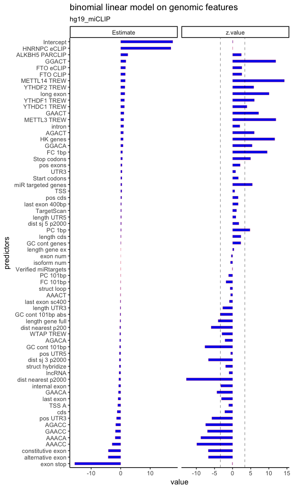

User guide for package m6ALogisticModel
================

Installation
------------

Currently, you could install the package using this command in R.

``` r
devtools::install_github("ZhenWei10/m6ALogisticModel")
```

Motivation
----------

The major advantages of this package:

1.  Facilitate the data mining process on RNA level high-throughput data, while being able to deal with **confounding transcriptomic features** that are common in RNA genomics.

2.  Automatically generate features given bioconductor annotation files, this could reduce the traditional work load for creating and screening the highly significant RNA features one by one, while unable to account the dependencies between those features.

3.  Provide a template for the insightful linear modeling on the relationship between **belonging (dummy), relative position**, and length for a given region of a transcript. For example, the previous researches suggest that exon length, relative position on 3'UTR, and stop codons are important predictors for the presence of m6A mRNA modification under different biological contexts.

We will build the following design for a given transcript region to improve the topological insight gained on that region:

Belong\_Region\_X + Belong\_Region\_X::Length\_Region\_X + Belong\_Region\_X::Position\_Region\_X

**Generalized linear model** is a computational technique used here; it can efficiently quantify the scientific and statistical significance for all the features, while adjust their dependencies on each others. Also, the generalized linear model can be applied on different family of response variables, which can effectively model the transcriptomic data with different data forms (e.x. real valued, binary, and counts).

Finally, the generalized linear modeling can be coupled with model selection methods to reduce the potential negative effects in presence of large numbers of highly correlated features (high collinearity). Also, model selection can yield robust coefficient estimates that can generate reliable biological interpretations.

The funcions for the transcript feature annotation and the generalized linear modeling are included in this package; while at the same time, users can introduce more genomic features defined by them self using GRanges object. Effective visualization for comparations between multiple models are also implemented in this package.

Usage Demonstration --- Features Annotation
-------------------------------------------

``` r
library(m6ALogisticModel)
library(TxDb.Hsapiens.UCSC.hg19.knownGene)
library(BSgenome.Hsapiens.UCSC.hg19)
library(fitCons.UCSC.hg19)
library(phastCons100way.UCSC.hg19)
```

``` r
Additional_features_hg19 = list(
    HNRNPC_eCLIP = eCLIP_HNRNPC_gr,
    YTHDC1_TREW = YTHDC1_TREW_gr,
    YTHDF1_TREW = YTHDF1_TREW_gr,
    YTHDF2_TREW = YTHDF2_TREW_gr,
    miR_targeted_genes = miR_targeted_genes_grl,
    TargetScan = TargetScan_hg19_gr,
    Verified_miRtargets = verified_targets_gr,
    METTL3_TREW = METTL3_TREW,
    METTL14_TREW = METTL14_TREW,
    WTAP_TREW = WTAP_TREW,
    METTL16_CLIP = METTL16_CLIP,
    ALKBH5_PARCLIP = ALKBH5_PARCLIP,
    FTO_CLIP = FTO_CLIP,
    FTO_eCLIP = FTO_eCLIP
  )

hg19_miCLIP_se <- SummarizedExperiment(rowRanges = hg19_miCLIP_gr)

hg19_miCLIP_se <- predictors_annot(se = hg19_miCLIP_se,
                                   txdb = TxDb.Hsapiens.UCSC.hg19.knownGene,
                                   bsgnm = Hsapiens,
                                   fc = fitCons.UCSC.hg19,
                                   pc = phastCons100way.UCSC.hg19,
                                   struct_hybridize = Struc_hg19,
                                   feature_lst = Additional_features_hg19,
                                   hk_genes_list = HK_hg19_eids)
```

    ## feature 1 : 5'utr is generated.
    ## feature 2 : 3'utr is generated.
    ## feature 3 : cds is generated.
    ## feature 4 : stop codons 201bp is generated.
    ## feature 5 : start codons 201bp is generated.
    ## feature 6 : downstream 100bp of transcription start site is generated.
    ## feature 7 : downstream 100bp of transcription start site with sequence A is generated.
    ## feature 8 : exon with stop codon is generated.
    ## feature 9 : alternatively spliced exons is generated.
    ## feature 10 : constitutively spliced exons is generated.
    ## feature 11 : internal exons is generated.
    ## feature 12 : long exons (length > 400bp) is generated.
    ## feature 13 : the last exon is generated.
    ## feature 14 : 5' start 400 bp of the last exon is generated.
    ## feature 15 : 5' start 400 bp of the last exon including stop codons is generated.
    ## feature 16 : intron is generated.
    ## feature 17 : relative positioning on 5'utr is generated.
    ## feature 18 : relative positioning on 3'utr is generated.
    ## feature 19 : relative positioning on cds is generated.
    ## feature 20 : relative positioning on exon is generated.
    ## feature 21 : distance to the upstream (5' end) splicing junction is generated.
    ## feature 22 : distance to the downstream (3' end) splicing junction is generated.
    ## feature 23 : 3'UTR length (z-score) is generated.
    ## feature 24 : 5'UTR length (z-score) is generated.
    ## feature 25 : cds length (z-score) is generated.
    ## feature 26 : gene length-exons (z-score) is generated.
    ## feature 27 : gene length full transcript (z-score) is generated.
    ## feature 28 : motif --- AAACA is generated.
    ## feature 29 : motif --- GAACA is generated.
    ## feature 30 : motif --- AGACA is generated.
    ## feature 31 : motif --- GGACA is generated.
    ## feature 32 : motif --- AAACT is generated.
    ## feature 33 : motif --- GAACT is generated.
    ## feature 34 : motif --- AGACT is generated.
    ## feature 35 : motif --- GGACT is generated.
    ## feature 36 : motif --- AAACC is generated.
    ## feature 37 : motif --- GAACC is generated.
    ## feature 38 : motif --- AGACC is generated.
    ## feature 39 : motif --- GGACC is generated.
    ## feature 40 : clustering indicators --- distance to the nearest neigboors (peaked at 2000bp) is generated.
    ## feature 41 : clustering indicators --- distance to the nearest neigboors (peaked at 200bp) is generated.
    ## feature 42 : phast cons scores 1bp is generated.
    ## feature 43 : phast cons scores 101bp is generated.
    ## feature 44 : fitness consequences scores 1bp z score is generated.
    ## feature 45 : fitness consequences scores 101bp z score is generated.
    ## feature 46 : RNA structure --- predicted hybridized region is generated.
    ## feature 47 : RNA structure --- inferred loop structures between hybridized region is generated.
    ## feature 48 : annotation feature --- HNRNPC_eCLIP is generated.
    ## feature 49 : annotation feature --- YTHDC1_TREW is generated.
    ## feature 50 : annotation feature --- YTHDF1_TREW is generated.
    ## feature 51 : annotation feature --- YTHDF2_TREW is generated.
    ## feature 52 : annotation feature --- miR_targeted_genes is generated.
    ## feature 53 : annotation feature --- TargetScan is generated.
    ## feature 54 : annotation feature --- Verified_miRtargets is generated.
    ## feature 55 : annotation feature --- METTL3_TREW is generated.
    ## feature 56 : annotation feature --- METTL14_TREW is generated.
    ## feature 57 : annotation feature --- WTAP_TREW is generated.
    ## feature 58 : annotation feature --- METTL16_CLIP is generated.
    ## feature 59 : annotation feature --- ALKBH5_PARCLIP is generated.
    ## feature 60 : annotation feature --- FTO_CLIP is generated.
    ## feature 61 : annotation feature --- FTO_eCLIP is generated.
    ## feature 62 : snc RNA (<= 200bp) is generated.
    ## feature 63 : lnc RNA (> 200bp) is generated.
    ## feature 64 : isoform number z score is generated.
    ## feature 65 : exon number z score is generated.
    ## feature 66 : house keeping genes is generated.
    ## feature 67 : gene level GC content z score is generated.
    ## feature 68 : 101bp GC content z score is generated.
    ## feature 69 : absolute value of the 101bp GC content z score is generated.

Usage Demonstration --- Generalized Linear Modeling
---------------------------------------------------

``` r
glm_regular(Y = hg19_miCLIP_gr$Target > 0,
            PREDICTORS = as.data.frame( rowData(hg19_miCLIP_se)[,-1] ),
            family = "binomial",
            HDER = "hg19_miCLIP")
```



``` r
sessionInfo()
```

    ## R version 3.4.2 (2017-09-28)
    ## Platform: x86_64-apple-darwin15.6.0 (64-bit)
    ## Running under: macOS Sierra 10.12.6
    ## 
    ## Matrix products: default
    ## BLAS: /Library/Frameworks/R.framework/Versions/3.4/Resources/lib/libRblas.0.dylib
    ## LAPACK: /Library/Frameworks/R.framework/Versions/3.4/Resources/lib/libRlapack.dylib
    ## 
    ## locale:
    ## [1] zh_CN.UTF-8/zh_CN.UTF-8/zh_CN.UTF-8/C/zh_CN.UTF-8/zh_CN.UTF-8
    ## 
    ## attached base packages:
    ## [1] parallel  stats4    stats     graphics  grDevices utils     datasets 
    ## [8] methods   base     
    ## 
    ## other attached packages:
    ##  [1] phastCons100way.UCSC.hg19_3.6.0        
    ##  [2] fitCons.UCSC.hg19_3.6.0                
    ##  [3] GenomicScores_1.2.2                    
    ##  [4] BSgenome.Hsapiens.UCSC.hg19_1.4.0      
    ##  [5] BSgenome_1.46.0                        
    ##  [6] rtracklayer_1.38.3                     
    ##  [7] Biostrings_2.46.0                      
    ##  [8] XVector_0.18.0                         
    ##  [9] TxDb.Hsapiens.UCSC.hg19.knownGene_3.2.2
    ## [10] GenomicFeatures_1.30.3                 
    ## [11] AnnotationDbi_1.40.0                   
    ## [12] m6ALogisticModel_0.3.3                 
    ## [13] SummarizedExperiment_1.8.1             
    ## [14] DelayedArray_0.4.1                     
    ## [15] matrixStats_0.53.1                     
    ## [16] Biobase_2.38.0                         
    ## [17] GenomicRanges_1.30.3                   
    ## [18] GenomeInfoDb_1.14.0                    
    ## [19] IRanges_2.12.0                         
    ## [20] S4Vectors_0.16.0                       
    ## [21] BiocGenerics_0.24.0                    
    ## 
    ## loaded via a namespace (and not attached):
    ##  [1] Rcpp_0.12.17                  lattice_0.20-35              
    ##  [3] prettyunits_1.0.2             Rsamtools_1.30.0             
    ##  [5] assertthat_0.2.0              rprojroot_1.3-2              
    ##  [7] digest_0.6.15                 mime_0.5                     
    ##  [9] R6_2.2.2                      plyr_1.8.4                   
    ## [11] backports_1.1.2               RSQLite_2.0                  
    ## [13] evaluate_0.10.1               BiocInstaller_1.28.0         
    ## [15] httr_1.3.1                    ggplot2_2.2.1                
    ## [17] pillar_1.2.3                  zlibbioc_1.24.0              
    ## [19] rlang_0.2.0                   progress_1.1.2               
    ## [21] lazyeval_0.2.1                blob_1.1.1                   
    ## [23] Matrix_1.2-14                 rmarkdown_1.9                
    ## [25] labeling_0.3                  RMySQL_0.10.14               
    ## [27] BiocParallel_1.12.0           AnnotationHub_2.10.1         
    ## [29] stringr_1.3.0                 RCurl_1.95-4.10              
    ## [31] bit_1.1-14                    biomaRt_2.34.2               
    ## [33] munsell_0.4.3                 shiny_1.0.5                  
    ## [35] httpuv_1.3.6.2                compiler_3.4.2               
    ## [37] pkgconfig_2.0.1               htmltools_0.3.6              
    ## [39] nnet_7.3-12                   tibble_1.4.2                 
    ## [41] GenomeInfoDbData_1.0.0        interactiveDisplayBase_1.16.0
    ## [43] XML_3.98-1.11                 GenomicAlignments_1.14.2     
    ## [45] bitops_1.0-6                  grid_3.4.2                   
    ## [47] xtable_1.8-2                  gtable_0.2.0                 
    ## [49] DBI_1.0.0                     magrittr_1.5                 
    ## [51] scales_0.5.0                  stringi_1.2.2                
    ## [53] reshape2_1.4.3                tools_3.4.2                  
    ## [55] bit64_0.9-7                   yaml_2.1.19                  
    ## [57] colorspace_1.3-2              cluster_2.0.7-1              
    ## [59] memoise_1.1.0                 knitr_1.20
